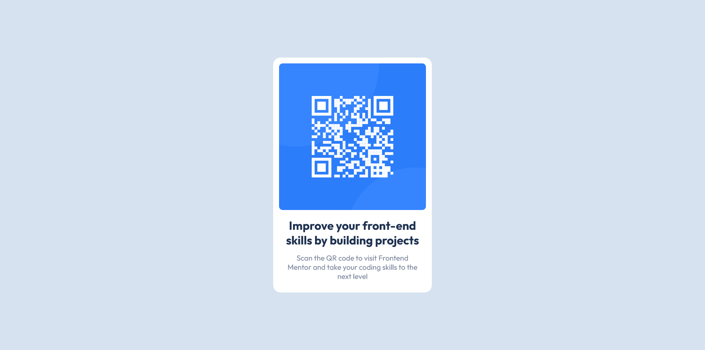

# Frontend Mentor - QR code component solution

This is a solution to the [QR code component challenge on Frontend Mentor](https://www.frontendmentor.io/challenges/qr-code-component-iux_sIO_H). Frontend Mentor challenges help you improve your coding skills by building realistic projects.

## Table of contents

- [Overview](#overview)
  - [Screenshot](#screenshot)
  - [Links](#links)
- [My process](#my-process)
  - [Built with](#built-with)
  - [What I learned](#what-i-learned)
  - [Continued development](#continued-development)
- [Author](#author)
- [Acknowledgments](#acknowledgments)

## Overview

### Screenshot



### Links

- Solution URL: [GitHub Solution Page](https://github.com/AnalystKAL/QR-Code-Component)
- Live Site URL: [GitHub Pages](https://analystkal.github.io/QR-Code-Component/)

## My process

### Built with

- Semantic HTML5 markup
- CSS Media Query
- Flexbox
- Mobile-first workflow

### What I learned

With this challenge I was able to improve my flexbox skill but this time I was required to make a column flexbox which used the flex-direction property set to column.

Implemented lessons learnt regarding accessibility headers (landmarks headers main -> h1 -> p)

```css
.qr-card {
  display: flex;
  background-color: white;
  flex-direction: column;
  max-width: 400px;
  max-height: 800px;
  border-radius: 20px;
  padding: 1rem;
}

@media (max-width: 550px) {
  .qr-card {
    overflow: hidden;
    max-width: calc(100vw - 40px);
    margin: 1.5rem;
  }
}
```

### Continued development

Re-adjust width and height values if they mismatch with solution.

## Author

- Kal
- GitHub Profile - [@AnalystKAL](https://github.com/AnalystKAL)
- Frontend Mentor - [@AnalystKAL](https://www.frontendmentor.io/profile/AnalystKAL)

## Acknowledgments

I learnt a few lessons about mobile view flexbox and proper media query format from @femacaraeg Product Card solution. Thank you Fe.
